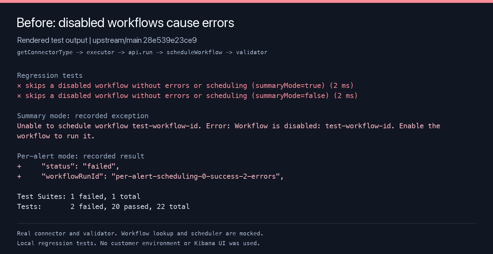
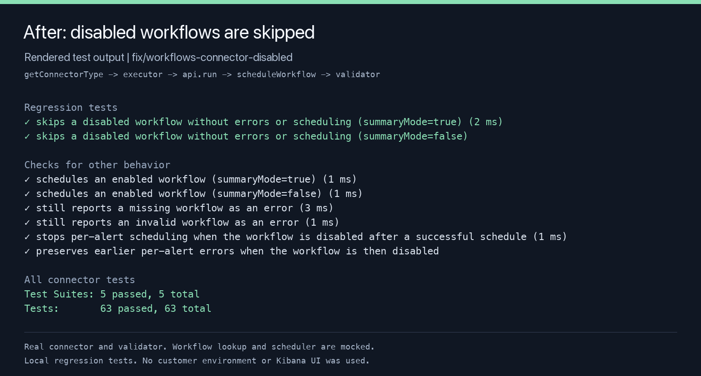

# Disabled workflow connector: test evidence

These images show excerpts from recorded Jest output. They are rendered test-output images. Browser access was unavailable, so no Kibana UI screenshots were captured.

The tests call the registered connector executor and use the real connector service, API handler, and workflow validator. Workflow lookup and the management API scheduler are mocked. No customer environment was used.

## Before

Base commit: `28e539e23ce939367caf3b178a3cd49a460e6de3` (`elastic/kibana` main).

The two regression tests fail on the original production code:

- Summary mode throws `WorkflowDisabledError`, wrapped as an error from the scheduling service.
- Per-alert mode returns `failed` and counts one error for each alert.

The validator blocks the scheduler call in both modes.



Full output: [before.log](before.log).

## After

The connector returns `status: ok` and `data.status: skipped` for a disabled workflow. There are no error or warning logs and no scheduler calls. The per-alert loop stops at the first disabled result. Earlier successful schedules and earlier errors keep their results.

All 63 connector tests pass. The new tests also cover enabled workflows, missing workflows, invalid workflows, and disablement during per-alert scheduling.



Full output: [after.log](after.log), [connector_tests.log](connector_tests.log).

## Commands

Use Node 24.21.0.

```sh
node scripts/jest src/platform/plugins/shared/workflows_management/server/connectors/workflows/index.test.ts --runInBand
node scripts/jest src/platform/plugins/shared/workflows_management/server/connectors/workflows --runInBand
```
